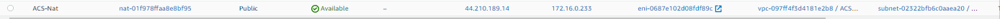
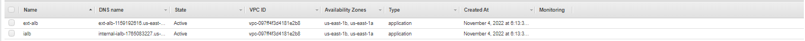
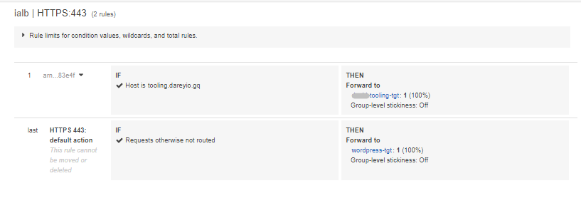
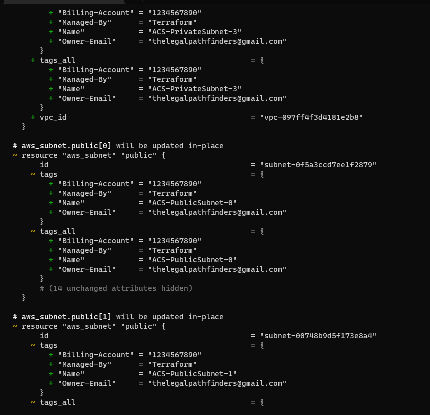
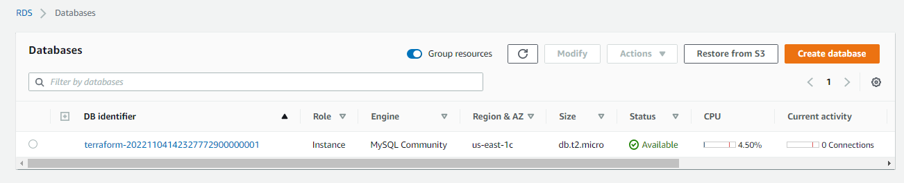
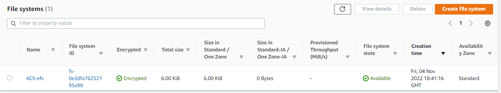

## AUTOMATE INFRASTRUCTURE WITH IAC USING TERRAFORM. PART 2
-
**Introduction**
-
In project 16, i introduced a new DevOps concept known as Terraform, proceded to building AWS infrastructure for 2 websites strategically using terraform. I deployed soem infrastructures in project 16, and this project is a continuation. The end point is to build AWS infrastructure for 2 functioning websites. In this project, using terraform, i was able to deploy the following aws infrastructures: Internet gateway, Loadbalancer, Launch templates, Private subnets, routes tables, route 53, AWS issued Certificate, Elastic file system, security groups amongst others. In the subsequent paragraphs and contents, i'd take you through how i achieved that. However, Before we go deeper into automating other parts of our infrastructure on AWS, it is very important to fully understand certain concepts around Networking (in case this is completely new area to you). Networking is a very broad topic and some of internals of Terraform modules related to Networking, like cidrsubnet(), may still not be fully clear to you. To fully clear your understanding, I highly recommend you watch Networking videos by **Eli** the Computer Guy on YouTube, and in addition to that, read following golden articles on Networking Terminology, Interfaces, Protocols, IP Address, Subnets, and CIDR Notation by Justin Ellingwood from Digital Ocean. First thing was run `terraform init` to initialize the existing processes. See the image below:

- **Continue Infrastructure Automation with Terraform**

*Create 4 private subnets keeping in mind following principles:*

- Make sure you use variables or length() function to determine the number of AZs
- Use variables and cidrsubnet() function to allocate vpc_cidr for subnets
- Keep variables and resources in separate files for better code structure and readability
- Tags all the resources you have created so far. Explore how to use format() and count functions to automatically tag subnets with its respective number.
One important thing about tags is that it is a very powerful concept that helps you manage your resources much more efficiently. I introduced tags into my codes to keep thing on check.

**Internet Gateways & format() function**
-
Create an Internet Gateway in a separate Terraform file internet_gateway.tf (I created a file in the `PBL` folder and named it `internet-gw.tf` and updated it according to the codes provided in the documentation)

**NAT Gateways**
-
Create 1 NAT Gateways and 1 Elastic IP (EIP) addresses(I created a file in the `PBL` folder and named it `natgateway.tf` then i updated the file with the codes in the documentation accordingly)

**AWS ROUTES**
-
I created a file called `route_tables.tf` and used the same file to create routes for both public and private subnets, I then created aws_route_table, aws_route, aws_route_table_association and ensured they were properly tagged. After updating and configuring the file with the codes provided in the documentation, I ran terraform plan and terraform apply and it added the following resources to AWS in multi-az set up:

– the main vpc
– 2 Public subnets
– 4 Private subnets
– 1 Internet Gateway
– 1 NAT Gateway
– 1 EIP
– 2 Route tables

Check the images below to see images of the results `terraform apply` and the confirmation on AWS console.

**AWS Identity and Access Management**
-
I need to pass an IAM role on my EC2 instances to give them access to some specific resources, so all i need to do is the following:
- Create AssumeRole
Assume Role uses Security Token Service (STS) API that returns a set of temporary security credentials that you can use to access AWS resources that you might not normally have access to. These temporary credentials consist of an access key ID, a secret access key, and a security token. Typically, you use AssumeRole within your account or for cross-account access.
- Second thing to do is to create IAM policy for this role where i need to define a required policy (i.e., permissions) according to the requirements. For example, allowing an IAM role to perform action describe applied to EC2 instances
- Inside the `roles.tf` file, I attached the Policy to the IAM Role where, I will be attaching the policy which I created above, to the role created in the first step.
- The final step under the rile is to create an Instance Profile and interpolate the IAM Role.

**CREATING SECURITY GROUPS**
-
I created inside the `PBL` folder and named it `security.tf` which i created all the security groups, set their inbound rules and other neccesary configuration manually done using aws in project 15. I created and configured  the following security groups using the codes provided in the documentation inside the file:
- datalayer
-bastion
- nginx
- external and internal load balancer
-Webserver

**CREATE CERTIFICATE FROM AMAZON CERIFICATE MANAGER**
-
I created `cert.tf` file inside the `PBL` folder and added the code snippets in the documentation to it.

**Create an external (Internet facing) Application Load Balancer (ALB)**
-
I created `alb.tf` file inside the `PBL` folder and added the code snippets in the documentation to it.
To inform the Application Load Balancer to where route the traffic I  created a Target Group to point to its targets after which I created a Listner for this target Group. For the Internal Load balancer I followed the same concepts with the external load balancer. I created a new file and named it `output.tf` aftr which i added some code snippets with the aim of printing the code on the screen.
I rsn `terraform plan` and a`applied the new changes and thse images below were below:

**CREATING AUSTOALING GROUPS**
-
Now we need to configure our ASG to be able to scale the EC2s out and in depending on the application traffic.

Before we start configuring an ASG, we need to create the launch template and the the AMI needed. For now we are going to use a random AMI from AWS, then in project 19, we will use Packerto create our ami.

Based on our Architetcture we need for Auto Scaling Groups for bastion, nginx, wordpress and tooling, so we will create two files; asg-bastion-nginx.tf will contain Launch Template and Austoscaling froup for Bastion and Nginx, then asg-wordpress-tooling.tf will contain Launch Template and Austoscaling group for wordpress and tooling.
I created `asg-bastion-nginx.tf` and pasted the code snippet made available in the documentation and created notification for all the auto scaling groups. Inside tyhe same file, i configured the launch template for bastion. 

- Insidr another file, `asg-wordpress-tooling.tf`, I created the Autoscaling group for wordpress and toolibng separately. 

**STORAGE AND DATABASE**
-
In order to create an EFS, I created a KMS key since AWS Key Management Service (KMS) makes it easy for you to create and manage cryptographic keys and control their use across a wide range of AWS services and in your applications.
So i created a file and named it `efs.tf` and configured it accordingly with code provided in the documntation. 
- I created the RDS itself using this snippet of code in `rds.tf` file and configured it accordingly. 
- Lastly, i updated the last file which is `terraform.tfvars` file. In this file, I  declared the values for the variables in the `varibales.tf file`. Check the images below to see the final output.

**Additional tasks**
-
*IP ADDRESS*
- An Internet Protocol address is a numerical label that is connected to a computer/phone network that uses the Internet Protocol for communication. An IP address serves two main functions: the network interface identification and address location.
- Contrary to the above definition of IP address,a subnetwork or subnet is a logical subdivision of an IP network. The practice of dividing a network into two or more networks is called subnetting. 

- CIDR Notation: CIDR means Classless Inter-Domain Routing and it's majorly for compact representation of an IP address and its associated network mask. This is a useful feature for service providers and network operator who frequently allocate and work with subnets.
- IP Routing- IP Routing is an umbrella term for the set of protocols that specifically determines the path that data follows in order to travel across multiple networks from its source to its destination. Data is routed from its source to its destination through a series of routers, and across multiple networks.
- Internet Gateway- An internet gateway is a horizontally scaled, redundant, and highly available VPC component that allows communication between your VPC and the internet. It supports IPv4 and IPv6 traffic. It does not cause availability risks or bandwidth constraints on your network traffic. It technically means it is the *gate - way* like a passage or a conduit that allows network the VPc to connect or speak with the internet easily without any constraint.
- What Is NAT? NAT stands for network address translation. It's a way to map or monitor multiple local private addresses to a public one before transferring the information. Organizations that want multiple devices to employ a single IP address use NAT, as do most home routers.  It works by only allowing internet traffic to pass through if a device on the private network requested it. A NAT firewall protects the identity of a network and doesn't show internal IP addresses to the internet.

- Difference between IAM Roles and Policy is that IAM Roles manage who has access to the user's AWS resources, whereas IAM policies control their permissions. A Role with no Policy attached to it won't have to access any AWS resources. In other words, An IAM identity represents a user, and can be authenticated and then authorized to perform actions in AWS. Each IAM identity can be associated with one or more policies. Policies determine what actions a user, role, or member of a user group can perform, on which AWS resources, and under what conditions.

- OSI refers to Open Systems Interconnection, whereas TCP/IP refers to Transmission Control Protocol. OSI follows a vertical approach, whereas TCP/IP follows a horizontal approach. OSI model, the transport layer, is only connection-oriented, whereas the TCP/IP model is both connection-oriented and connectionless. The TCP/IP or the Transmission Control Protocol/ Internet Protocol is a communication protocols suite using which network devices can be connected to the Internet.TCP and IP are two separate computer network protocols. IP is the part that obtains the address to which data is sent. TCP is responsible for data delivery once that IP address has been found. On the other hand, the Open Systems Interconnection or OSI Model is a conceptual framework, using which the functioning of a network can be described. In concludsion, TCP/IP uses only one layer (link). OSI model, the transport layer is only connection-oriented. A layer of the TCP/IP model is both connection-oriented and connectionless. In OSI model, data link layer and physical are separate layers.

This brings us to the end of Project 17 Implementation.